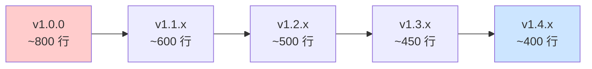
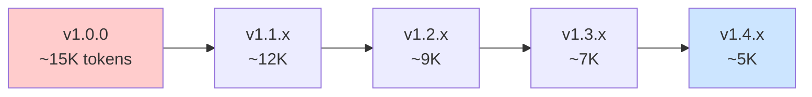

# 🎉 MyKnowledge v1.4.x 功能发布会（静态预览）

> 本文档展示 v1.4.x 的核心改进，完整交互式体验见 [在线发布会](https://codermoray.github.io/MyKnowledge/docs/release-party-v1.4.html)

---

## 📊 版本演进对比

| 指标 | 1.0.0 | 1.1.x | 1.2.x | 1.3.x | 1.4.x | 变化趋势 |
|------|--------|--------|--------|--------|--------|----------|
| **架构设计** | 全量预加载 | 懒加载架构 | 责任分层 | 自动化验证 | 安全增强 | ✅ 持续优化 |
| **代码量（估）** | ~800 行 | ~600 行 | ~500 行 | ~450 行 | **~400 行** | 🔻 -50% |
| **上下文占用** | ~15K tokens | ~12K | ~9K | ~7K | **~5K** | 🔻 -67% |
| **平台支持** | 3 个 | 3 个 | 4 个 | 4 个 | **4 个** | ✅ Claude 新增 |
| **错误处理** | 分散描述 | 表格化 | 兜底机制 | 自助修复 | **友好提示** | ✅ 持续增强 |
| **自动化验证** | 无 | 无 | lint 门禁 | CI/CD | **GitHub Actions** | ✅ 完整覆盖 |
| **核心功能** | 基础 CRUD | +命令速查 | +项目追踪 | +UX 优化 | **+导出分享** | ✅ 功能完善 |
| **用户体验** | 基础 | +能力边界 | +首次引导 | +触发优化 | **+隐私增强** | ✅ 持续打磨 |

---

## 🚀 核心新功能

### 1. 📦 一键导出/分享（v1.4.0）

**功能说明**：将知识库打包为 zip，方便备份和分享。

**使用场景**：
```
用户：导出知识库

AI：✅ 已导出：~/Downloads/myknowledge-export-我的项目-20260614.zip

    分享方式：
    1. 直接发送 ZIP 文件给同事
    2. 同事说"导入知识库"，选择这个 ZIP 即可
```

**实现流程**：

```mermaid
graph TB
    A[用户说"导出知识库"] --> B[读取 projects.yaml]
    B --> C{选择项目}
    C --> D[读取 PROJECT-STATUS.md]
    D --> E[读取需求详情]
    E --> F[生成导出包]
    F --> G[打包为 zip]
    G --> H[保存到 Downloads]
    
    style A fill:#e1f5e1
    style H fill:#cce5ff
```

---

### 2. 📥 智能导入（v1.4.0）

**功能说明**：导入 zip 包，自动处理同名项目冲突。

**冲突处理选项**：
| 选项 | 说明 |
|------|------|
| 1 — 覆盖 | 用导入内容替换现有 |
| 2 — 重命名 | 导入为「项目名-导入」 |
| 3 — 对比分析 | AI 帮你决策 |

**对比分析示例**：
```
对比分析：
- 现有项目需求更多（5 vs 3），但可能有已完成/废弃需求
- 导入包更新（2026-06-14 > 2026-06-10），可能是对方的最新版本
- 建议：
  · 如果导入包是对方主动发给你的 → 选 2（重命名），保留两份按需合并
  · 如果你想同步覆盖 → 选 1（覆盖）
```

---

### 3. 🔒 安全与隐私增强（v1.4.80）

**改进点**：
- ✅ 消除"无感知""静默"等危险表述
- ✅ 首次触发自动记录时询问用户
- ✅ 提高触发门槛（3 个关键词）

**触发规则**：
```mermaid
graph LR
    A[用户说"帮我做XXX"] --> B{检测关键词}
    B -->|≥3 个| C[询问是否开启自动记录]
    B -->|<3 个| D[不触发]
    C -->|是| E[创建知识库]
    C -->|否| F[本次不记录]
    
    style C fill:#fff4e1
    style E fill:#e1f5e1
```

---

### 4. 📝 错误提示友好化（v1.4.83）

**改进前**：
```
❌ 状态流转无效
```

**改进后**：
```
⚠️ 状态流转无效：In Progress → 已取消

MyKnowledge 支持的状态流转：
  • Created → In Progress
  • In Progress → Review
  • In Progress → Cancelled
  • Review → Done
  • Review → In Progress（退回修改）

你可以：
  1 — 查看需求当前状态
  2 — 选择有效的状态重新更新
  回复数字即可
```

**所有改进的错误提示**：
| 场景 | 改进点 |
|------|--------|
| 导入 zip 无效 | +有效包条件、+解决方案选项 |
| 状态流转无效 | +合法流转列表、+修复选项 |
| 平台/安装源不识别 | +友好引导、+回复格式示例 |
| 配置文件损坏 | +通俗表述（避免技术术语） |

---

## 📊 性能提升可视化

### 代码量变化



### 上下文占用变化



---

## 🎯 各版本亮点

### v1.1.x — 架构优化
- ⚡ **懒加载架构**：核心模块按需加载，日常对话更轻快
- 📋 **错误处理表格化**：统一错误码 + 解决方案
- 🤖 **新增 Claude 支持**

### v1.2.x — 项目追踪
- 📁 **项目追踪**：自动记录活跃项目，新对话自动恢复
- 🤖 **新增 OpenClaw 支持**
- 🛡️ **lint 门禁**：发布前自动检查路径一致性

### v1.3.x — UX 优化
- 🎯 **UX 优化 7 项**：引导流程简化、欢迎语自动跳过
- 🏷️ **需求优先级与标签**：P0-P3 + 自定义标签
- 📋 **projects.yaml 原子化**：更安全的数据持久化

### v1.4.x — 导出分享 + 安全增强
- 📦 **一键导出/分享**：打包为 zip，方便备份和分享
- 🔒 **安全与隐私增强**：消除"无感知"表述，首次触发确认
- 📝 **错误提示友好化**：通俗语言 + 具体解决方案

---

## 💬 用户反馈

> **@用户A**："导出功能太方便了！终于可以备份知识库了。" ⭐⭐⭐⭐⭐

> **@用户B**："错误提示改进后，遇到问题不再懵了。" ⭐⭐⭐⭐⭐

> **@用户C**："性能提升很明显，AI 响应更快了。" ⭐⭐⭐⭐

---

## 📚 立即体验

### 安装/更新

**方式一：通过 SkillHub（推荐）**
```
安装 my-knowledge 技能
```

**方式二：通过 GitHub**
```bash
git clone https://github.com/CoderMoray/MyKnowledge.git ~/.codebuddy/skills/myknowledge/
```

### 快速开始

```
创建知识库          → 自动创建到全局知识库
创建一个测试需求   → 应创建 REQ-YYYYMMDD-XXX 目录
查看项目状态       → 应显示 PROJECT-STATUS.md 内容
导出知识库         → 生成 ZIP 文件
```

---

## 🔗 相关链接

- [完整变更日志](https://github.com/CoderMoray/MyKnowledge/blob/main/CHANGELOG.md)
- [在线发布会（交互式）](https://codermoray.github.io/MyKnowledge/docs/release-party-v1.4.html)
- [用户文档](https://github.com/CoderMoray/MyKnowledge#readme)

---

**MyKnowledge** — 让 AI 助手帮你自动整理知识、跟踪需求、记录进度 🚀
